# 日学 (Benkyo AI)

日学是一款使用 AI 来生成专属定制课程的游戏化日语学习 App，数据完全存储在本地，交互体验参考 Duolingo。
它搭建了一套学习循环：生成课程，完成关卡，复习薄弱项，收集奖励，继续前进。

> 使用前需要在「我的 → 设置」配置 AI 模型，课程生成、题目生成都依赖该配置，支持 OpenAI、Anthropic、Google Gemini、DeepSeek、阿里云百炼 / Qwen、月之暗面 Kimi、智谱 GLM、火山引擎 / 豆包、百度千帆 / 文心、腾讯混元、MiniMax，以及自定义 OpenAI-compatible 端点。配置 TTS 语音模型后体验更佳，支持 CosyVoice、Qwen-TTS、MiniMax（阿里云百炼 / 官方 API）和豆包语音（火山引擎）。

## 截图导览

### AI 生成与章节地图

<table>
  <tr>
    <td align="center" width="33%">
      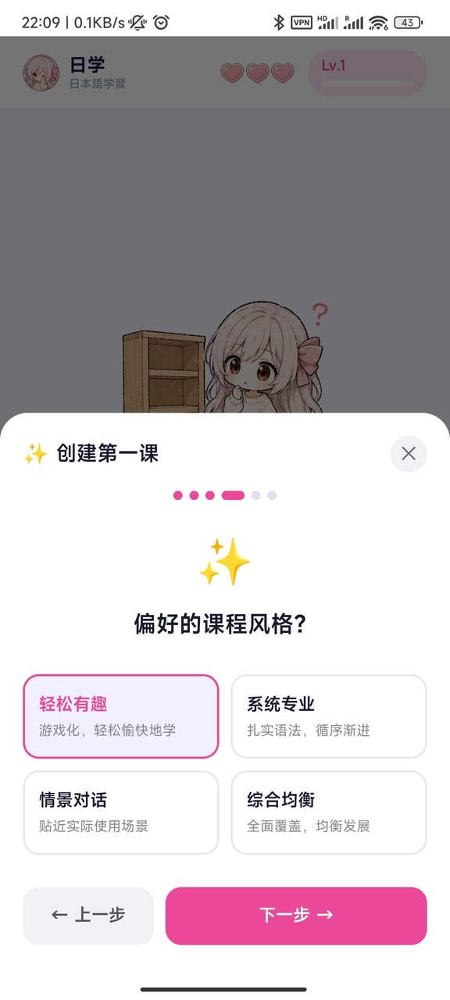<br>
      <strong>课程偏好选择</strong><br>
      <sub>首次创建课程时选择学习风格、场景和节奏。</sub>
    </td>
    <td align="center" width="33%">
      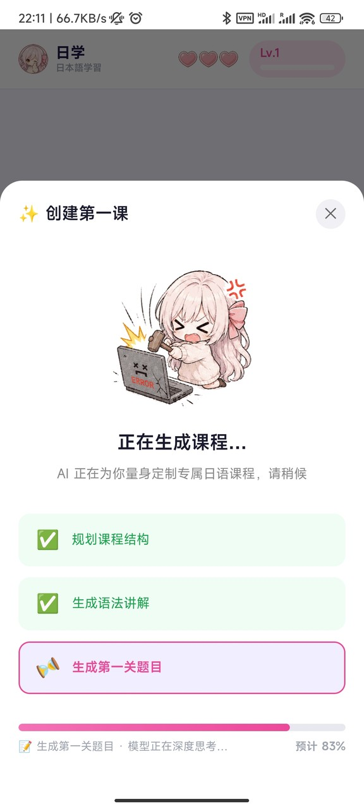<br>
      <strong>AI 生成进度</strong><br>
      <sub>展示规划课程结构、生成语法讲解和题目的流水线进度。</sub>
    </td>
    <td align="center" width="33%">
      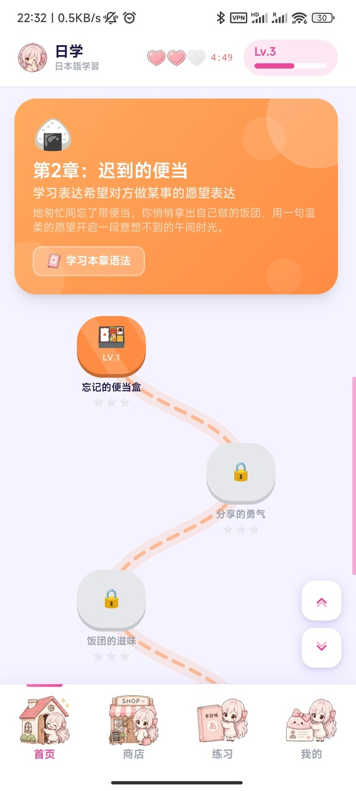<br>
      <strong>章节地图</strong><br>
      <sub>按章节推进关卡，显示语法入口、锁定状态、星级和生命值。</sub>
    </td>
  </tr>
</table>

### 课程学习与闯关

<table>
  <tr>
    <td align="center" width="33%">
      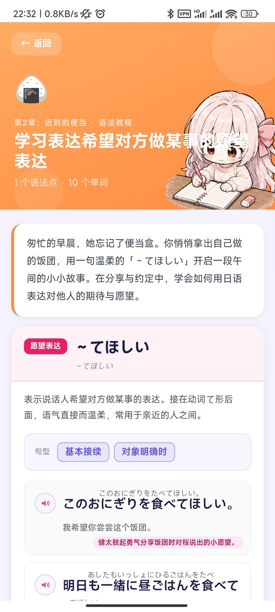<br>
      <strong>语法教程</strong><br>
      <sub>AI 生成章节语法、例句、词汇和可朗读的日语内容。</sub>
    </td>
    <td align="center" width="33%">
      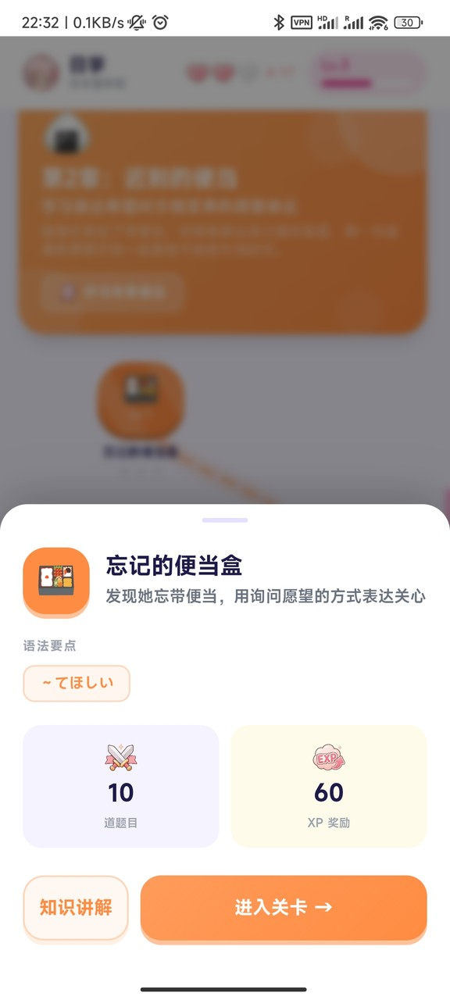<br>
      <strong>关卡详情</strong><br>
      <sub>进入关卡前查看语法要点、关卡知识讲解。</sub>
    </td>
    <td align="center" width="33%">
      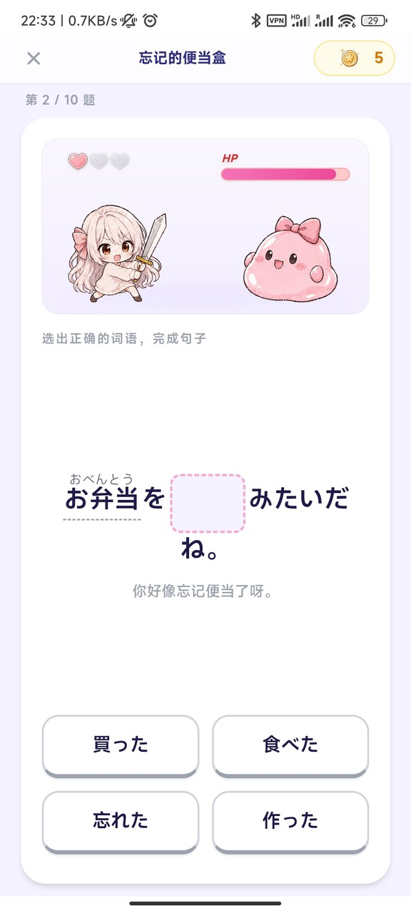<br>
      <strong>选词填空</strong><br>
      <sub>根据中文提示补全日语句子，保留假名注音。</sub>
    </td>
  </tr>
  <tr>
    <td align="center" width="33%">
      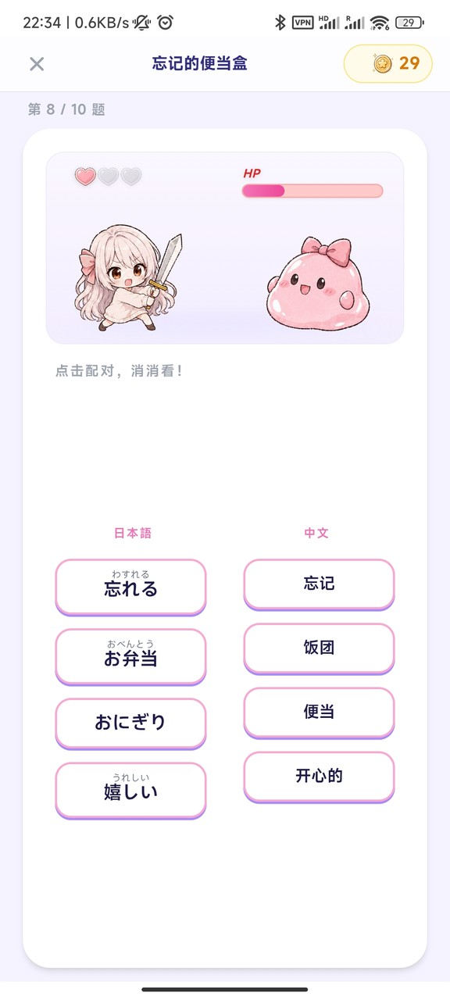<br>
      <strong>单词配对</strong><br>
      <sub>点击日语和中文词卡完成配对，适合快速记忆词汇。</sub>
    </td>
    <td align="center" width="33%">
      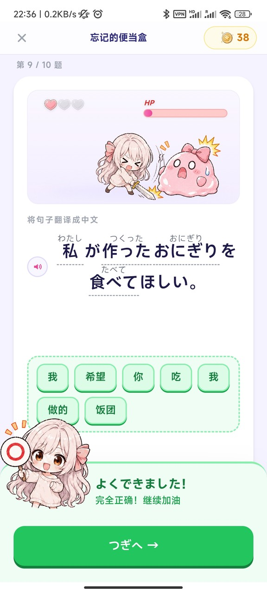<br>
      <strong>句子翻译</strong><br>
      <sub>使用词卡翻译日语句子，并结合反馈推进下一题。</sub>
    </td>
    <td align="center" width="33%">
      <br>
      <strong>关卡结算</strong><br>
      <sub>根据正确率结算星级、XP、金币等资源道具。</sub>
    </td>
  </tr>
  <tr>
    <td align="center" width="33%">
      <br>
      <strong>礼物盒奖励</strong><br>
      <sub>各种场景都有可能掉落礼物盒，开出金币或道具。</sub>
    </td>
    <td align="center" width="33%"></td>
    <td align="center" width="33%"></td>
  </tr>
</table>

### 练习中心与单词本

<table>
  <tr>
    <td align="center" width="50%">
      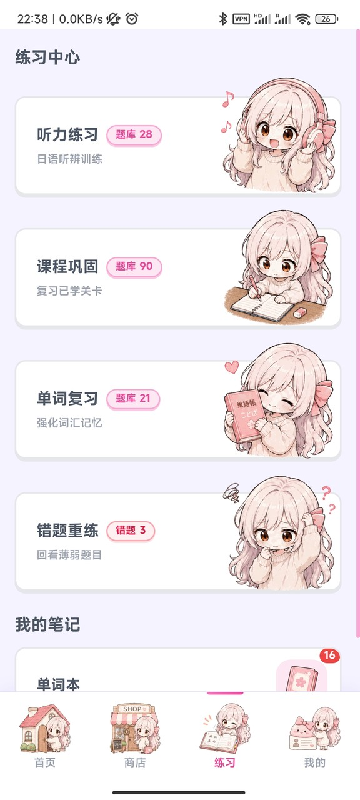<br>
      <strong>练习中心</strong><br>
      <sub>听力练习、课程巩固、单词复习、错题重练集中入口。</sub>
    </td>
    <td align="center" width="50%">
      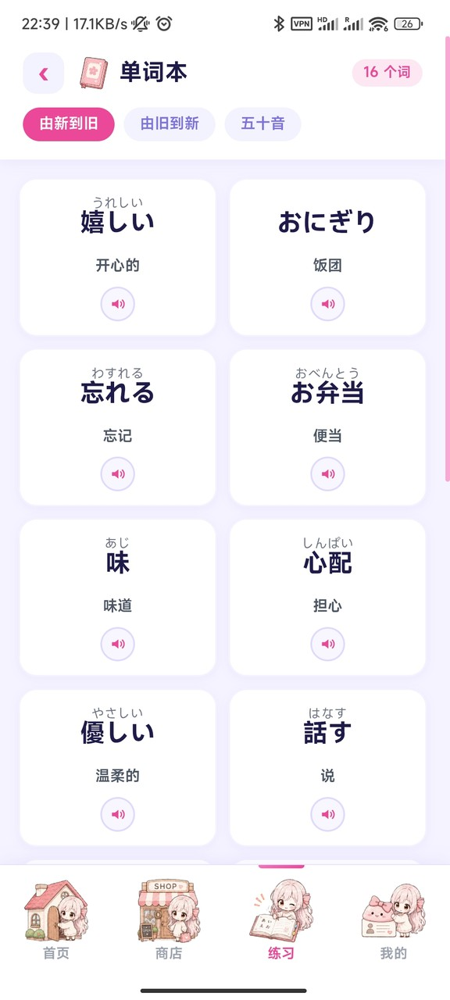<br>
      <strong>单词本</strong><br>
      <sub>自动收录词汇，支持排序、五十音筛选和单词朗读。</sub>
    </td>
  </tr>
</table>

### 商店、御守与个人成长

<table>
  <tr>
    <td align="center" width="33%">
      <br>
      <strong>道具商店</strong><br>
      <sub>购买 XP 加成、蛋糕、咖啡等道具，部分商品需要随着推进进度解锁。</sub>
    </td>
    <td align="center" width="33%">
      <br>
      <strong>御守 Gacha</strong><br>
      <sub>消耗金币抽取不同稀有度的御守，并解锁各种效果。</sub>
    </td>
    <td align="center" width="33%">
      <br>
      <strong>抽取结果</strong><br>
      <sub>类似游戏的滚动抽卡效果。</sub>
    </td>
  </tr>
  <tr>
    <td align="center" width="33%">
      <br>
      <strong>御守详情</strong><br>
      <sub>查看御守能力和文化小知识。</sub>
    </td>
    <td align="center" width="33%">
      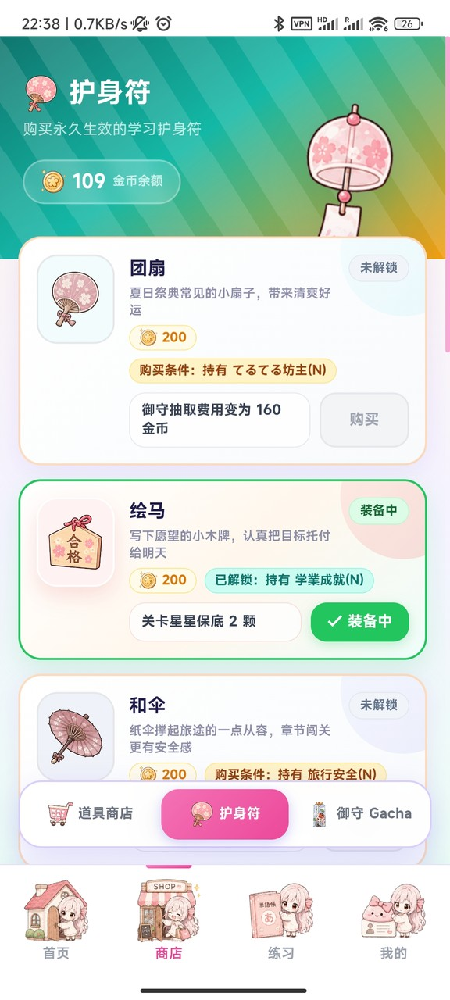<br>
      <strong>护身符装备</strong><br>
      <sub>解锁并装备护身符，获得各种各样的实际效果。</sub>
    </td>
    <td align="center" width="33%">
      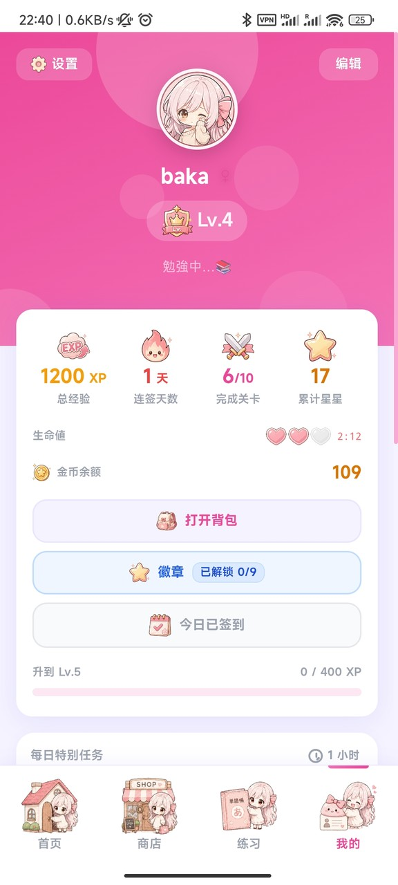<br>
      <strong>个人主页</strong><br>
      <sub>展示等级、XP、各种资源、每日任务和章节进度。</sub>
    </td>
  </tr>
  <tr>
    <td align="center" width="33%">
      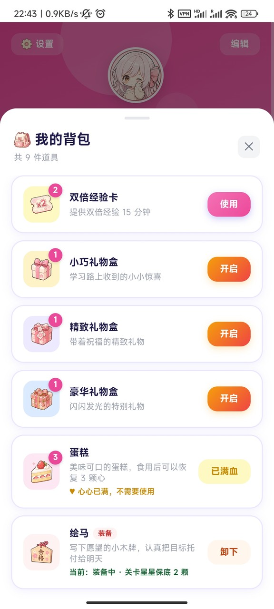<br>
      <strong>背包</strong><br>
      <sub>管理各种各样的消耗道具和已装备的护身符。</sub>
    </td>
    <td align="center" width="33%"></td>
    <td align="center" width="33%"></td>
  </tr>
</table>

## 技术栈

| 层级 | 技术 |
| --- | --- |
| UI | React 19、React Router DOM 7、HashRouter |
| 构建 | Vite 8、Tailwind CSS v4、GSAP 3 |
| 状态 | Zustand 5、persist、本地优先存储 |
| AI | Vercel AI SDK 6、OpenAI、Anthropic、Google、OpenAI-compatible provider |
| TTS | CosyVoice、Qwen-TTS、MiniMax、豆包语音，IndexedDB 音频缓存 |
| 客户端 | Tauri v2、Rust、桌面端、Android |

## 项目结构

```text
src/
├── pages/          # 首页、闯关、练习中心、商店、我的、设置等页面
├── components/     # 章节地图、题型、练习、商店、资料页和通用 UI
├── store/          # Zustand stores：用户、课程、关卡、徽章、任务、TTS、AI 等
├── lib/            # AI 生成、题目构造、TTS、音效、奖励、装备效果等逻辑
└── data/           # 商店、徽章、御守等静态配置

src-tauri/          # Tauri v2 桌面端与 Android 壳层
images/             # README 截图资源
scripts/            # Android release 打包脚本
```

## 本地开发

```bash
npm install
npm run dev
```

Tauri 开发模式：

```bash
npm run tauri:dev
```

应用内「我的 → 设置」配置 AI 与 TTS。API Key、模型、Base URL、音色等配置会保存在本地。

## 构建

```bash
npm run lint
npm run build
npm run tauri:build
```

Android release APK：

```bash
npm run android:release -- -KeystorePath .\android-signing\benkyo-ai-release.jks -KeyAlias benkyo-ai
```

首次创建 keystore 时：

```bash
npm run android:release -- -CreateKeystore -KeystorePath .\android-signing\benkyo-ai-release.jks -KeyAlias benkyo-ai
```

Android 构建需要 Rust、Android SDK/NDK。Windows 构建前需开启开发者模式。更多说明见 [scripts/README-android.md](scripts/README-android.md)。

豆包语音（火山引擎）TTS 以及听力练习的分词系统需要 Tauri Rust 代理，需在 `npm run tauri:dev` 或打包后的应用中测试。

## 鸣谢

### 开源项目

- [daac-tools/vibrato](https://github.com/daac-tools/vibrato)：用于日语文本分词 / 形态素分析。Vibrato 基于 Viterbi 算法实现，采用 MIT License / Apache License 2.0 双许可证。

### 素材与音效

- [効果音ラボ](https://soundeffect-lab.info/)
- [Kenney](https://kenney.nl/)

## License

MIT
